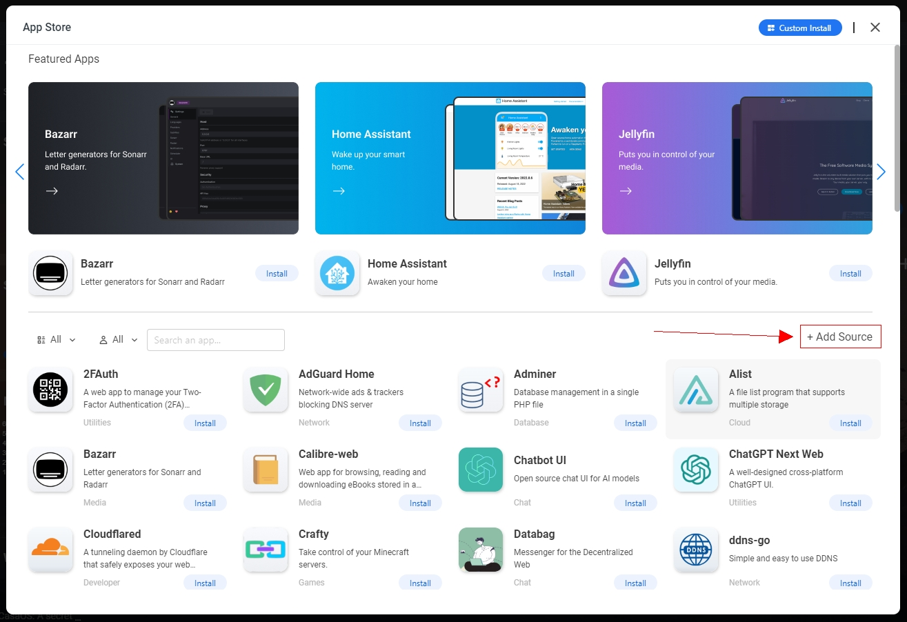

# CasaOS LocalAI AppStore

A CasaOS custom Appstore containing some usefull images.
The **LocalAI AppStore** is a custom appstore built to work for [CasaOS](https://github.com/IceWhaleTech/CasaOS).
This custom appstore for CasaOS contains some additional configurations of docker images which are not available in the official appstore and I think they are useful.

## 🛠 List of Applications

### **1. [Serge.chat](https://github.com/serge-chat/serge)** (version: 0.5.0)

Serge is a sophisticated web interface designed for chatting with Alpaca through llama.cpp. This software stands out for its full dockerization and user-friendly API. It offers a seamless experience for users looking to interact with Alpaca models, providing a SvelteKit frontend and Redis for storing chat history and parameters. Serge is built on FastAPI + LangChain for the API, wrapping calls to llama.cpp using Python bindings.

### **2. [Mimic 3](https://mycroft-ai.gitbook.io/docs/mycroft-technologies/mimic-tts/mimic-3)** (version: 3.0.0)

Mimic is a fast, lightweight Text-to-speech engine developed by Mycroft A.I. and VocaliD, based on Carnegie Mellon University’s FLITE software. Mimic takes in text and reads it out loud to create a high quality voice. Mimic is low-latency and has a small resource footprint. It is great for embedded devices and servers alike. Mimic is also multi-lingual, supporting English, German, Spanish, French, and Italian.

### **3. [Elasticsearch](https://www.elastic.co/elasticsearch/)** (version: 7.15.0)

Elasticsearch is a distributed, RESTful search and analytics engine capable of solving a growing number of use cases. As the heart of the Elastic Stack, it centrally stores your data so you can discover the expected and uncover the unexpected.

### **4. [ElasticHQ](https://github.com/ElasticHQ/elasticsearch-HQ)** (version: 3.5.12)

ElasticHQ is a simple, lightweight, free application that allows you to monitor and manage your ElasticSearch clusters with ease. Works with 2.x, 5.x, 6.x, 7.x and current versions of Elasticsearch. Monitor many clusters at once. Monitor Nodes, Indices, Shards, and general cluster metrics. Create and maintain Elasticsearch Indices. One-Click access to ES API and cat API endpoints. Easy-to-Use Querying capabilities. Copy mappings and reindex Indices. Real-time monitoring charts of important metrics. Diagnostics check-up helps alert to specific nodes having issues. Active project used by Fortune 100 companies around the world.

## ✅ Installation

- Go to your CasaOS dashboard.

- Open the appstore and click `Add Source` button located on the right just above the apps list.

  

- Paste the appstore link

```bash
https://github.com/eudard/CasaOS-LocalAI-AppStore/archive/refs/tags/latest.zip
```

- Then click `Add` to submit and Wait for the installation to finish. Done!

> **NOTE: Custom Appstore is only supported on CasaOS version [0.4.4](https://blog.casaos.io/blog/32.html) and above. **

## Supporting/Sponsoring this project

You like the project and you want to support me?

[](https://www.paypal.com/donate/?hosted_button_id=7XXMAR2GYQ6BE)
